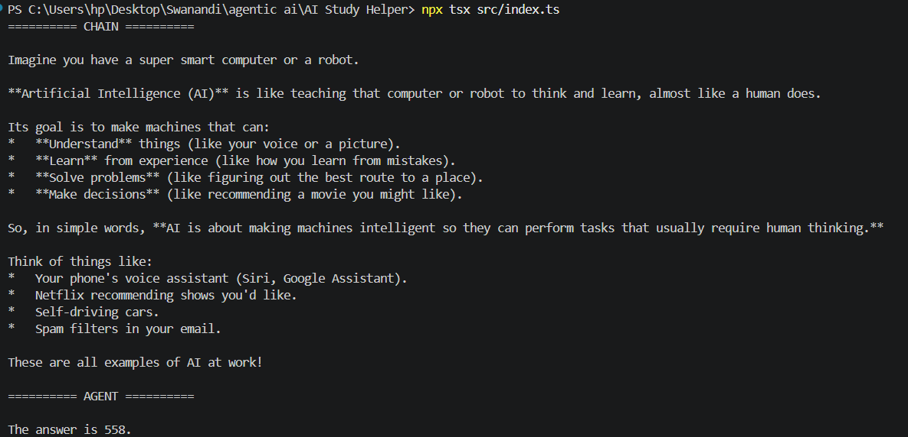
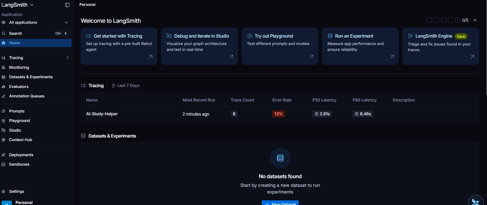
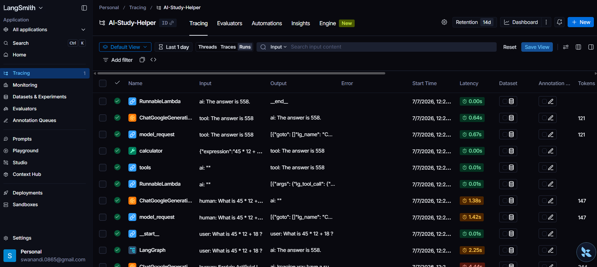

# 📚 AI Study Helper using LangChain

An AI-powered Study Helper built with **TypeScript**, **LangChain**, and **Google Gemini**. This project demonstrates the fundamentals of building an AI 
application using LangChain, including prompt templates, chains, agents, tool calling, context management, and LangSmith tracing.

---

## 🚀 Project Overview

This project helps users understand study-related concepts by interacting with Google's Gemini model through LangChain. It demonstrates how developers can build 
intelligent AI applications using reusable chains, prompt templates, and agents.

The application includes:

- A **LangChain Chain** for answering study-related questions.
- A **LangChain Agent** that decides when to use a tool (calculator) to solve mathematical expressions.
- **LangSmith tracing** to inspect execution flow, debug issues, and understand how the application processes requests.

---

# ❓ What does LangChain solve?

Building AI applications directly with an LLM API can become difficult as projects grow. Developers need prompt management, memory, tools, context handling,
and debugging.

LangChain provides a framework that simplifies these tasks by allowing developers to build modular AI applications using reusable components such as:-

- Prompt Templates
- Chains
- Agents
- Tools
- Memory
- Context Management
- Tracing with LangSmith

---

# 💡 Why use LangChain?

Developers use LangChain because it makes AI applications:

- Modular
- Reusable
- Easier to maintain
- Easier to debug
- Easy to connect with external APIs and tools

Instead of writing everything manually, LangChain provides building blocks for creating production-ready AI applications.

---

# 🏗️ Project Architecture

```
                    User Question
                          │
                          ▼
                 Prompt Template
                          │
                          ▼
              Google Gemini Model
                          │
          ┌───────────────┴───────────────┐
          │                               │
          ▼                               ▼
      Study Chain                 LangChain Agent
                                          │
                                          ▼
                                  Calculator Tool
                                          │
                                          ▼
                                  Final AI Response
```

---

# ✨ Features

- Built with TypeScript
- Google Gemini Integration
- Prompt Templates
- LangChain Chains
- LangChain Agents
- Calculator Tool
- Context Management
- Memory Concept
- LangSmith Tracing
- AI-powered responses

---

# 🛠 Technologies Used

- TypeScript
- Node.js
- LangChain
- Google Gemini API
- LangSmith
- dotenv

---

# 📂 Project Structure

```
AI-Study-Helper
│
├── screenshots
│   ├── terminal-output.png
│   ├── langsmith-dashboard.png
│   └── langsmith-trace.png
│
├── src
│   ├── agent.ts
│   ├── chain.ts
│   ├── index.ts
│   ├── model.ts
│   ├── prompt.ts
│   └── tools.ts
│
├── .gitignore
├── .env.example
├── package.json
├── tsconfig.json
└── README.md
```

---

# 🔄 Prompt Flow

The application follows this flow:

1. User enters a question.
2. Prompt Template formats the request.
3. Gemini receives the prompt.
4. LangChain processes the response.
5. If a mathematical question is detected, the Agent invokes the Calculator Tool.
6. The final response is displayed to the user.

---

# 🔗 Chains

The project demonstrates a **LangChain Chain** that connects:

```
Prompt Template
        ↓
Gemini Model
        ↓
Generated Response
```

The chain is responsible for generating study-related answers.

---

# 🤖 Agents

The project also demonstrates a **LangChain Agent**.

Unlike a simple chain, the agent decides whether it should answer directly or use a tool.

Example:

**Input**

```
What is 45 * 12 + 18?
```

The agent automatically selects the **Calculator Tool**, computes the answer, and returns:

```
The answer is 558.
```

---

# 🔧 Tool Usage

The application includes a Calculator Tool.

The tool:

- Receives a mathematical expression.
- Evaluates the expression.
- Returns the calculated answer.

This demonstrates how LangChain Agents can interact with external tools instead of relying only on the language model.

---

# 🧠 Memory Handling

The project introduces the concept of conversation memory.

While this demo keeps the implementation simple, LangChain supports maintaining conversation history so that future responses can consider previous interactions. This enables more natural, context-aware conversations.

---

# 📄 Context Management

Context management ensures that the AI receives relevant information before generating a response.

In this project:

- Prompt Templates organize user input.
- Structured prompts help the model understand the task.
- The design can be extended to include conversation history and retrieved knowledge.

---

# 📊 LangSmith Tracing

LangSmith is used to monitor and debug the application's execution.

It provides:

- Prompt inspection
- Model execution traces
- Tool execution tracking
- Token usage
- Latency measurements
- Debugging support

Using LangSmith makes it easier to understand how the AI application processes each request.

---

# ▶️ Installation

Clone the repository:

```bash
git clone https://github.com/Swanandi-28/AI-Study-Helper.git
```

Navigate into the project:

```bash
cd AI-Study-Helper
```

Install dependencies:

```bash
npm install
```

Create a `.env` file:

```env
GOOGLE_API_KEY=YOUR_GEMINI_API_KEY
LANGSMITH_API_KEY=YOUR_LANGSMITH_API_KEY
LANGSMITH_TRACING=true
LANGSMITH_PROJECT=AI-Study-Helper
```

Run the application:

```bash
npx tsx src/index.ts
```

---

# 📸 Screenshots

## Terminal Output



---

## LangSmith Dashboard



---

## LangSmith Trace



---

# 📈 Sample Output

```
========== CHAIN ==========

Artificial Intelligence is the simulation of human intelligence by machines.

========== AGENT ==========

The answer is 558.
```

---
